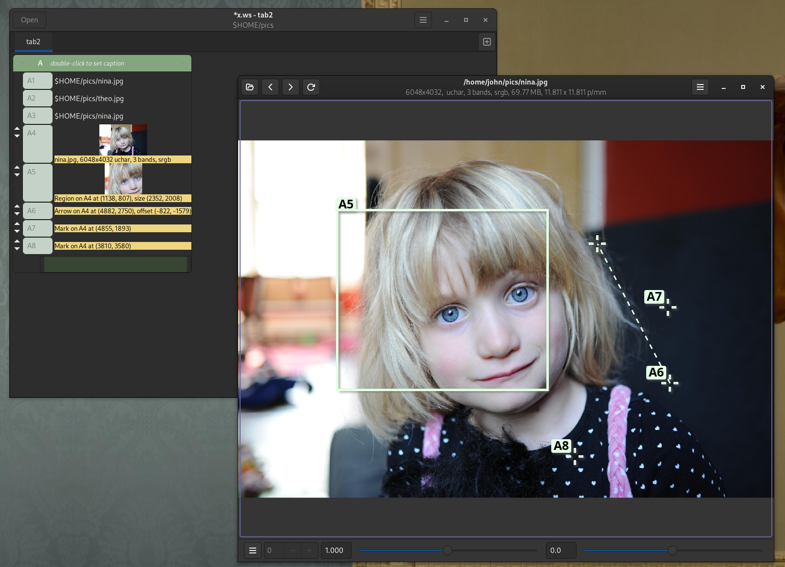
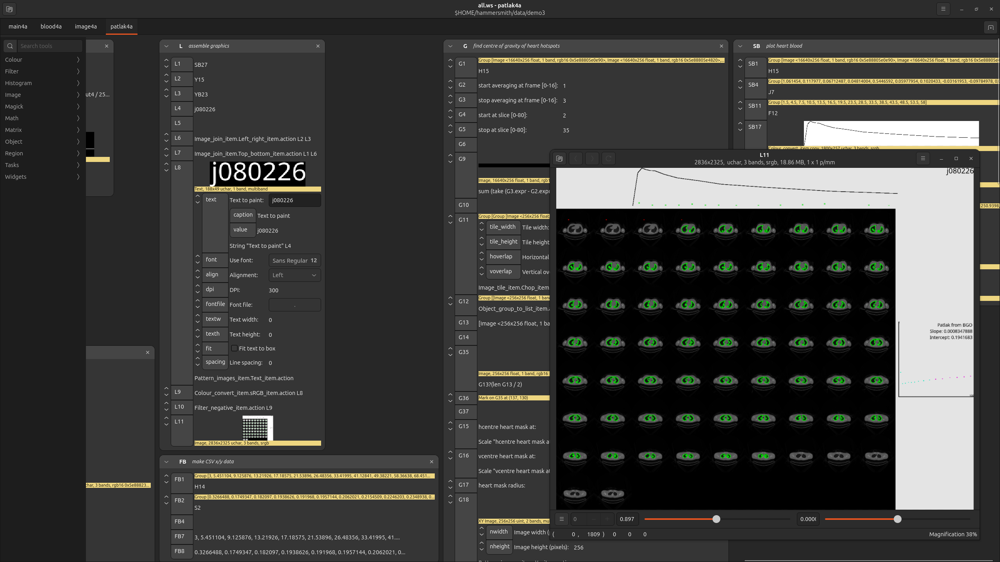

# nip4 --- a user interface for libvips

**Work in progress** See screenshots and videos below for the current state.
I'm hoping this will be mostly working in early 2025.

This is a reworking of [nip2](https://github.com/libvips/nip2) for the gtk4
UI toolkit and the vips8 image processing library.

nip4 is a spreadsheet-like interface to the [libvips image processing
library](https://libvips.github.io/libvips). You create a set of formula
connecting your objects together, and on a change nip4 will recalculate.
This makes it convenient for developing image processing systems since you
can watch pixels change as you adjust your equations.

Because nip4 uses libvips as the image processing engine, it can handle very
large images and only needs a little memory. It scales to fairly complex
workflows: I've used it to develop systems with more than 10,000 cells,
analyzing images of many tens of gigabytes.

It has a batch mode, so you can run any image processing system you develop
from the command-line and without a GUI.

[](images/shot1.png)

[](images/shot2.png)

https://github.com/user-attachments/assets/6f7bdee1-183c-4554-9701-e0c30e75d58a

# Installing

## Windows

There's a zip for each version on the [releases
page](https://github.com/jcupitt/nip4/releases). Download
`vips-dev-w64-all-8.16.0-nip4.zip`, unzip somewhere, and run `bin/nip4.exe`.

## macOS

We hope to have a homebrew formula soon.

## Linux-like systems with flatpak

There's a PR to add nip4 to flathub here:

https://github.com/flathub/flathub/pull/6166

Once we get a stable release, nip4 will be added to flathub. You can install
one of the test releases from that PR with eg.:

```
flatpak install --user \
    https://dl.flathub.org/build-repo/165060/org.libvips.nip4.flatpakref
```

## From source

Download the sources, then build and install with eg.:

```
cd nip4-x.y.x
meson setup build --prefix /my/install/prefix
cd build
meson compile
meson test
meson install
```

Check the output of `meson setup` carefully.

## From source for Windows

Clone:

https://github.com/libvips/build-win64-mxe

Then see this PR:

https://github.com/libvips/build-win64-mxe/pull/72

Checkout that branch and build with eg.:

```
./build.sh --with-nip4 all
```

## Build from source for flathub

Add the `flathub` repo, if you don't already have it:

```shell
flatpak remote-add --if-not-exists \
  flathub https://flathub.org/repo/flathub.flatpakrepo
```

Install the gtk4 SDK and runtime:

```shell
flatpak install org.gnome.Sdk//47
flatpak install org.gnome.Platform//47
```

Allow file. Recent security changes to git will cause submodule checkout
to fail inside flatpak. If you get errors like `fatal: transport 'file'
not allowed`, re-enable file transport with:

```shell
git config --global protocol.file.allow always
```

You need the latest `flatpak-builder` (the one in deb is not new enough),
install with:

```
flatpak install org.flatpak.Builder
```

Build and try running it:

```shell
flatpak run org.flatpak.Builder --force-clean --user --install build-dir org.libvips.nip4.json
flatpak run org.libvips.nip4 ~/pics/k2.jpg
```

Force a complete redownload and rebuild (should only rarely be necessary) with:

```shell
rm -rf .flatpak-builder
```

Check the files that are in the flatpak you built with:

```shell
ls build-dir/files
```

Uninstall with:

```shell
flatpak uninstall nip4
```

## Notes on flatpak build process

- niftiio is annoying to build, skip it.

- x265 is annoying to build, skip it

- we skip imagemagick as well, too huge

## Packaging for flathub

Install the appdata checker:

```shell
flatpak install flathub org.freedesktop.appstream-glib
flatpak run org.freedesktop.appstream-glib validate org.libvips.nip4.metainfo.xml
```

Also:

```shell
desktop-file-validate org.libvips.nip4.desktop
```

## Uploading to flathub

Make a PR on:

        https://github.com/flathub/org.libvips.nip4

then check the build status here:

        https://flathub.org/builds/#/apps/org.libvips.nip4

On success, merge to master.

